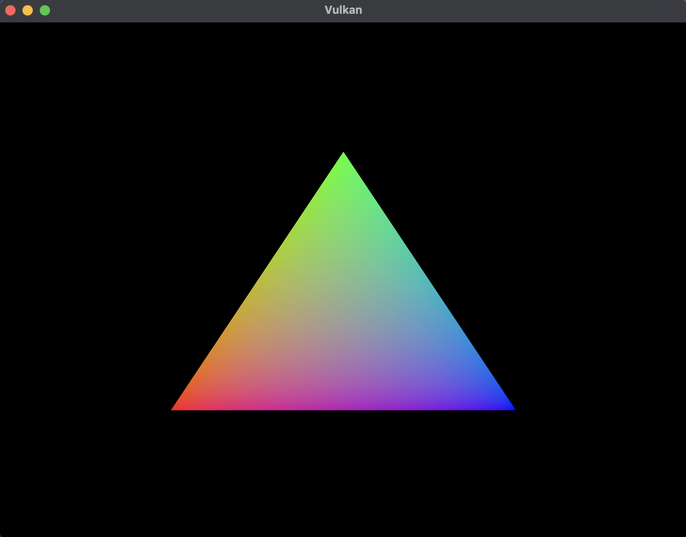

# Vulkan

## References

- [Getting started with the macOS Vulkan SDK](https://vulkan.lunarg.com/doc/view/latest/mac/getting_started.html)
- [Vulkan Tutorial](https://vulkan-tutorial.com)
- [Vulkan guide by Victor Blanco](https://vkguide.dev)
- [Youtube - Vulkan C++ by Brendan Galea](https://www.youtube.com/playlist?list=PL8327DO66nu9qYVKLDmdLW_84-yE4auCR)
